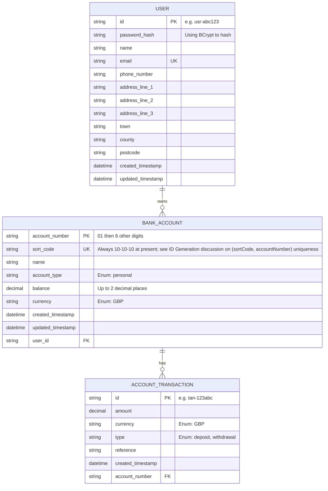

# Design Decisions

Whilst instructions and an OpenAPI spec have been provided, I have made some design decisions which I have recorded below. These are intended to reflect a balance between pragmatism and realism, given the scope of a take-home task, while being sensitive to patterns that would matter in a production-grade system.

The reasons are in some cases explained more below, but I have deviated from the spec deliberately on a couple of matters that I will mention up front:
- I will be storing hashed passwords to support the auth feature, so password will become a required field on user creation
- The story for creating a user without required data says "Given a user has successfully authenticated". However, I think that this endpoint should return 400 status regardless of authentication
- I have implemented somewhat more verbose error response bodies than are indicated in the OpenAPI spec
- The expected response object for a transaction includes userId but not accountId. For reasons explained below, I see the accountId as a more critical link than userId (although I would usually discuss rather than simply stray off spec as here)
---

## Requirements Analysis

### Implied Entities and Assumptions

The spec implies a number of business entities. The way in which we interpret these will affect the overall design (and complexity):

- **User** – the operations in the spec are those of a bank customer specifically, as opposed to bank staff, who may otherwise act as admins or super-admins. 
  - Due to only modelling customers, not staff, I will not be implementing more complicated access controls such as RBAC or ABAC, but authorisation will be tied almost completely to authentication (see separate section on auth). 
  - Since the prescribed auth method is JWT-based, we would need to add role or scope based claims to the JWT and potentially add a user-role mapping to the data model to facilitate anything more complex.

- **Bank account**
  - All operations in the spec are performed by a single user, who is bound to one or more accounts. There is nothing in the spec that implies a possibility of multiple account holders. Whilst I will be sensitive to that as a common requirement in terms of data storage, I will not actively implement any behaviours to allow multiple account holders, since it falls outside the scope. 
  - Additionally, a real-world system might have account statuses such as 'locked', 'pending closure', or 'frozen' that would interact with the behaviours in the spec. These are important considerations for real banking systems but are out of scope for this exercise.

- **Account Transaction**
  - There are two kinds of transactions mentioned: deposit and withdrawal, each affecting the account balance. 
  - I will model these immutably and append-only, as the spec states that transactions cannot be modified or deleted.

Additionally, the behaviours that should be carried out by/on those entities imply the following:
  - Users should have sufficient properties to support authentication and authorization.
  - Accounts should be validated for ownership on every operation.
  - Transactions should be atomic and consistent (consistent in the ACID sense rather than the CAP sense - at large, distributed scale, there would be additional considerations in terms of concurrency safety, locking, transactional consistency etc.).
---

## Data Design

At the simplest level, the physical model simply reflects the business entities.

However, the following decisions were made which impact it:

### Authentication & Authorization

#### Authentication

The PDF scenario requires an endpoint that issues JWT tokens upon successful authentication.

**Design decisions:**

- Implement a `POST /v1/auth/login` endpoint, where users authenticate using their email and password.
- Passwords are hashed and stored using BCrypt for secure password storage.
  - This means we will need to store password hash alongside user information
    - It will also be a small deviation from the provided OpenAPI spec, that does not require a password at user creation time
- Upon successful authentication, a JWT is returned that includes:
  - `sub` (subject): the user's userId
  - `exp`: expiration
  - Optional: email, scope, or role if expanded later
- Failed auth is handled via an AuthenticationEntryPoint which sets the response status to 401 and provides an error message to the user

**Alternatives considered:**

- There are multiple solid algorithms for password hashing including Argon2. However, BCrypt is good enough and is straightforward to set up with Spring.
- Session-based authentication: would require session storage and not fit a stateless REST model.
- Refresh tokens: would be useful to limit blast radius of compromised JWTs and make short expiration times more practical, but I am unlikely to have time to implement 
- JWT invalidation: would be useful to be able to revoke JWT validity, either on logout or for other reasons, but the additional complexity is not proportionate for this task
- OAuth2: overkill for this scope.

#### Authorization

Every request must be validated not only for authentication (valid JWT) but also authorization (user owns the resource).

**Design decisions:**

- Ownership is enforced by comparing the authenticated user’s `userId` - which comes from `sub` claim in JWT to the `userId` associated with the target entity (e.g., bank account).
- Implement using a custom `@OwnershipCheck` annotation or via controller-level logic.

**Alternatives considered:**

- RBAC/ABAC: not required for single-user-per-account setup.
- Spring Security method-level annotations: possible but unnecessary for this scope.

---

### Address Handling

I chose **not** to split address into its own table.

- **In favour of splitting:**
  - Could allow recording address history (useful for KYC or fraud investigation).
  - Could support users with multiple addresses (e.g., mailing and residential).
  - Could be used in multi-tenanted systems to normalize repeated addresses.

- **Against splitting:**
  - Increases implementation complexity for limited value in a take-home task.
  - Joins would be needed in most read operations.
  - Not explicitly required by any feature or use case in the spec.

If this were a production system, I would likely store addresses as separate records with history and a current flag or use a temporal model (with valid from/to fields to keep a permanent record of non-current addresses).

### Transaction-to-User Link

I chose to link transactions only to the account, not directly to the user.

- **In favour of direct user linkage:**
  - Would enable auditability of who performed the transaction.
  - Would be necessary for shared accounts or third-party transaction authorship (e.g., interest payments, customer support).

- **Against:**
  - The spec implies a strict 1-user-per-account setup.
  - The account's ownership is enough to infer the user for all current use cases.
  - Simpler to model and reason about.

If multi-user accounts or non-owner transaction creation were added later, I would reintroduce an explicit `userId` on the transaction.

### Terminology

I renamed the `Transaction` entity to `AccountTransaction` in the data model to avoid conflict with `TRANSACTION` being a reserved keyword in many SQL dialects and to better reflect its domain meaning.

### Audit Metadata

I chose **not** to implement auditing fields (`createdBy`, `source`, etc.).

This decision was made to reduce scope, but in a real-world context I would:
  - Record `createdBy` and `sourceSystem` for all mutating actions.
  - Include soft-deletion flags and updated timestamps for important entities.
  - Possibly emit audit events (e.g., Kafka or event sourcing) in a full system.

---

## Final Physical Model

## Functional considerations

### ID Generation

The OpenAPI spec specifies prefixed ID formats like `usr-abc123`, `tan-xyz456`, and account numbers starting with `01`.

**Design decisions:**

- For user and transaction, use a custom ID generator service that:
  - Generates a base UUID or alphanumeric string
  - Applies prefixes (`usr-`, `tan-`) consistently
- For account numbers, generate an 8-digit string starting with `01` and auto-incrementing from a base of `01000000`
  - Note that at production scale, having only 6 unique digits will become limiting quickly - we will run out of IDs at 1 million accounts
  - The important uniqueness in general would be of sort code + account number rather than only account number, so it would be possible to implement a more nuanced ID generation in that case
  - In this task, that makes no difference, since the sort code is fixed anyway

**Alternatives considered:**

- Auto-incrementing DB IDs: not compatible with the prefix format
- UUIDs without prefixes: less friendly for debugging or routing

---

### Transactions & Concurrency

Money movement must be consistent and atomic.

**Design decisions:**

- Use SQL transactions and row-level locks (`SELECT FOR UPDATE`) during withdrawal and deposit.
- This ensures that:
  - Account balance is fetched and locked
  - Validation is performed (e.g., sufficient funds)
  - Balance is updated only if all checks pass
  - A new `ACCOUNT_TRANSACTION` is inserted in the same DB transaction

**Alternatives considered:**

- Pessimistic locking vs optimistic locking: chose pessimistic (`FOR UPDATE`) for simplicity and safety.
- Eventual consistency or queues: overkill for this POC.

---

### Currency conversion
There is some hint of multi-currency possibilities in the fact that currency is part of the model for accounts and transactions. However, since it is always GBP, I have deliberately treated this as out of scope for this exercise.

### Error Handling

The spec clearly defines status codes for different failure types.

**Design decisions:**

- Implemented a global exception handler using `@ControllerAdvice` to:
  - Map exceptions to appropriate status codes
  - Return errors using the `ErrorResponse` or `BadRequestErrorResponse` schemas
  - Handle common exceptions such as:
    - `EntityNotFoundException` → 404
    - `AccessDeniedException` → 403
    - `InsufficientFundsException` → 422
    - `InvalidRequestException` → 400

**Alternatives considered:**

- Inline try/catch: less maintainable
- Returning error strings only: does not conform to the schema

---

## Tech stack main choices

In reality these would be driven by organisation preferences as much as anything but for this task:

### Java & Spring Boot
- Java is convenient and type safe when it comes to OOP - I am actually more familiar with Node + Express (with TypeScript) but the advertised role mentions Java/Spring, so it feels appropriate to use that
- Spring Boot accelerates setup and removes boilerplate, allowing faster iteration while still offering robust defaults.
- With built-in support for REST APIs, data validation, security (JWT), and database access via JPA/Hibernate, Spring provides nearly everything needed for this task.
- Spring Security integrates well with JWT-based authentication and offers extensibility if access control needs to scale.

### Relational data storage
- Given the nature of this system (dealing with financial transactions, strong consistency, and clear entity relationships) I have deliberately chosen a relational database over a non-relational alternative.
- Whilst non-relational gives schema flexibility, this comes at the cost of validation and strong consistency/transactional integrity.

### PostgreSQL
- ACID-Compliant - Guarantees transactional integrity, essential in financial applications. 
- Rich Feature Set - Supports constraints, indexing, row-level locking (FOR UPDATE), and UUID generation — ideal for enforcing business rules at the DB level. 
- JSON Support - Useful if we need to flexibly model metadata or audit trails later. 
- Open Source, reliable, and widely supported, including by cloud providers like AWS

## In scope only if time
- I may not implement pagination on account or transaction listings, but this would be trivial to add with page and limit query params, and would be important in a real world system

## Out of scope but possibly nice next steps

- Rate limiting
- Idempotency for transaction endpoints. I would consider this essential in production (e.g., retries due to client or network failure). Ideas for how this could be done are:
  - By insisting on an `Idempotency-Key` header from the client and stored alongside the transaction to detect duplicate requests
  - By hashing the request body and storing that alongside the transaction
- Emitting events or integrating messaging queues, which would normally be used for audit trails or external notifications.
